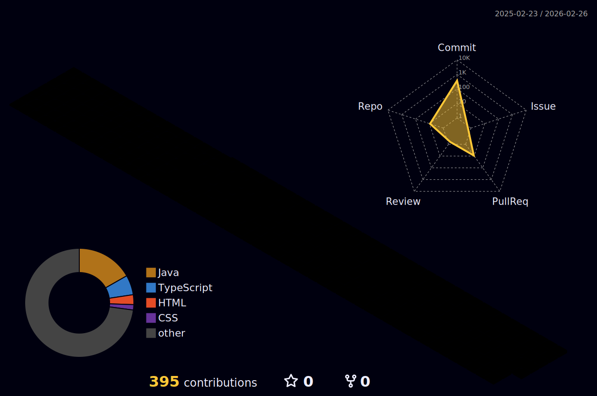
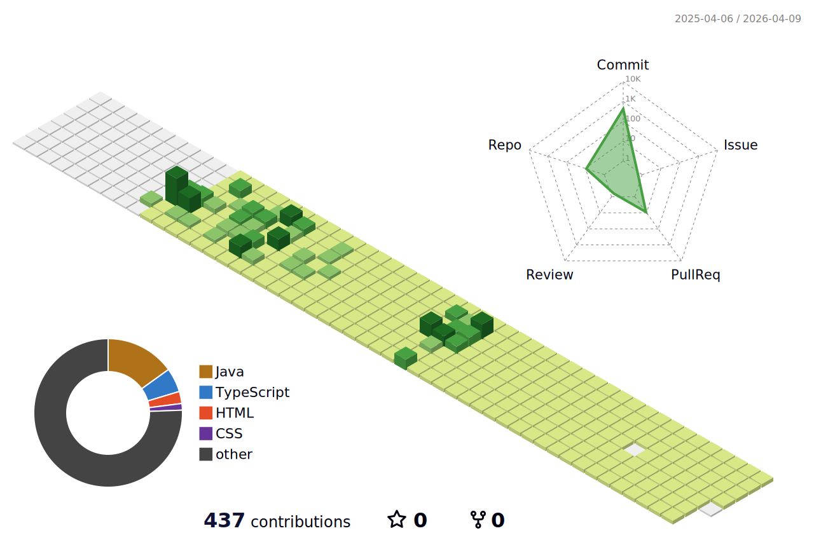

### Hi there! 👋 I'm Mina

<h3 align="center"> I'm a full-stack developer in training!🌱</h3>

💡 Passionate about turning ideas into real-world web apps 
🎯 Aiming to work in the <strong>Fintech industry</strong> after completing my full-time fullstack development study 

### 👩‍💻 About Me

- 💡 I'm a non-CS major, but I’m deeply committed to learning and creating real projects
- 👩‍🎓 I previously majored in **Hotel Management** and **Early Childhood Education**
- 🏨 I have worked in diverse fields such as hospitality, early childhood education, and international trade across South Africa, Australia, and South Korea.
- 💡 These experiences taught me the value of empathy, service mindset, and clear communication — all of which I now bring into my development journey with strong motivation😎
- 📚 I'm currently enrolled in a full-time fullstack development academy, studying over 8 hours a day.
- 🌱 so far, I’m especially interested in **DOM manipulation**, **fetch APIs**, and **event-driven UI design**
- 👩🏻‍💻 I'm currently learning **HTML, CSS, JavaScript, Oracle DB, and JAVA**
- 🚀 I'm aiming to work in the fintech industry after completing my full-time studies in full-stack development.
- 🤝 I love collaborating and growing with other developers🤍
- 🤝 Interested in collaborating on beginner-friendly open-source projects
- 🌍 Based in 🇰🇷 Korea and available for remote collaboration!

## 🧰 Skills & Tools

  
  
  
  
  
  
  

---

## 📊 GitHub Stats & Trophy

  
  

  

---

<!--## 📫 Connect with Me

  
  
<!--    -->

<!-- 3D GitHub 무지개 잔디 -->

<!-- 3D 잔디 레인보우 흰 배경-->
<!---->
